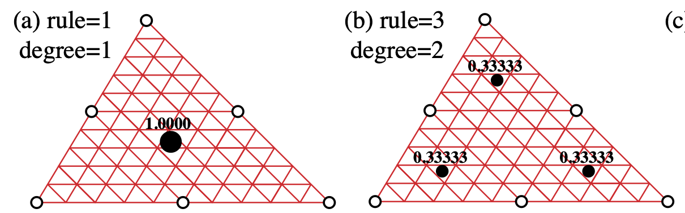

# TODO list

* ~~Trapezoid rule 2D~~
* ~~Trapezoid rule nD~~

* Ensemble methods
* Normalization
* Interpolation Methods: [Interpolation (scipy.interpolate)](https://docs.scipy.org/doc/scipy-1.12.0/reference/interpolate.html#interpolation-scipy-interpolate)
* Different optimizers
* Weak Sindy
* Gauss integral 1D
* Gauss integral 3D
* Gauss integral nD
* Make a function for triangular elements construction
* Algorithm for triangle element and adjacent elements with labels
* Write formalism for Vlasov equation

---

# Tests

* Test with Benni's data
* Test trapezoid rule with all examples
* Test different interpolation methods

# Examples

* ~~Burgers equation~~
* ~~Korteweg-deVries equation~~
* ~~Kuramato Sivishinky equation~~
* Nonlinear Schrödinger equation
* Quantum Harmonic Oscillator
* ~~Reaction Diffusion equation 2D~~
* Reaction Diffusion equation 3D
* Navier-Stokes
* Diffusion from random walk


# Mathematical Formulation of the Trapezoid Rule in Two Dimensions

The double integral of $ f(x,y) $ over the region $[a, b] \times [c, d]$ is given by:

$$
\iint_{[a, b] \times [c, d]} f(x, y) \, dx \, dy
$$

We can approximate this integral by dividing the region into a grid of smaller rectangles and applying the trapezoid rule to each dimension. 

1. **Divide the interval $[a, b]$ into $ n $ sub-intervals with points $ x_0, x_1, \ldots, x_n $.**
   $$
   x_i = a + i \frac{b-a}{n} \quad \text{for} \quad i = 0, 1, \ldots, n
   $$

2. **Divide the interval $[c, d]$ into $ m $ sub-intervals with points $ y_0, y_1, \ldots, y_m $.**
   $$
   y_j = c + j \frac{d-c}{m} \quad \text{for} \quad j = 0, 1, \ldots, m
   $$

3. **Define $ h_x = \frac{b - a}{n} $ and $ h_y = \frac{d - c}{m} $ as the widths of the sub-intervals in the $ x $ and $ y $ directions, respectively.**

The two-dimensional trapezoid rule formula is then:

$$
\iint_{[a, b] \times [c, d]} f(x, y) \, dx \, dy \approx \frac{h_x h_y}{4} \left[ \sum_{i=0}^{n} \sum_{j=0}^{m} w_{ij} f(x_i, y_j) \right]
$$

where $ w_{ij} $ are weights given by:
- $ w_{ij} = 1 $ if $ (i, j) $ is a corner (four corners),
- $ w_{ij} = 2 $ if $ (i, j) $ is on an edge but not a corner (edges excluding corners),
- $ w_{ij} = 4 $ if $ (i, j) $ is an interior point (all interior points).

To summarize:
- For corners: $ w_{ij} = 1 $
- For edges (excluding corners): $ w_{ij} = 2 $
- For interior points: $ w_{ij} = 4 $

### Putting It All Together

Combining all the terms, the two-dimensional trapezoid rule formula is:

$$
\iint_{[a, b] \times [c, d]} f(x, y) \, dx \, dy \approx \frac{h_x h_y}{4} \left[ f(x_0, y_0) + f(x_n, y_0) + f(x_0, y_m) + f(x_n, y_m) \right] \\
+ \frac{h_x h_y}{2} \left[ \sum_{i=1}^{n-1} \left( f(x_i, y_0) + f(x_i, y_m) \right) + \sum_{j=1}^{m-1} \left( f(x_0, y_j) + f(x_n, y_j) \right) \right] \\
+ h_x h_y \sum_{i=1}^{n-1} \sum_{j=1}^{m-1} f(x_i, y_j)
$$

This formula provides an approximation for the double integral of 4 f(x, y) 4 over the specified rectangular region using the trapezoid rule.


## Python Implementation
```python
def trapezoid_rule_2d(f, a, b, c, d, n, m):
    """
    Approximate the double integral of f over [a, b] x [c, d] using the trapezoid rule
    with n sub-intervals in the x-direction and m sub-intervals in the y-direction.
    
    Parameters:
    f (function): The function to integrate, f(x, y).
    a (float): The start of the interval in the x-direction.
    b (float): The end of the interval in the x-direction.
    c (float): The start of the interval in the y-direction.
    d (float): The end of the interval in the y-direction.
    n (int): The number of sub-intervals in the x-direction.
    m (int): The number of sub-intervals in the y-direction.
    
    Returns:
    float: The approximate double integral of f over [a, b] x [c, d].
    """
    h_x = (b - a) / n
    h_y = (d - c) / m

    integral = 0.0

    for i in range(n + 1):
        x = a + i * h_x
        for j in range(m + 1):
            y = c + j * h_y

            if (i == 0 or i == n) and (j == 0 or j == m):
                weight = 1
            elif (i == 0 or i == n) or (j == 0 or j == m):
                weight = 2
            else:
                weight = 4

            integral += weight * f(x, y)
    
    integral *= (h_x * h_y) / 4
    return integral

# Example usage
if __name__ == "__main__":
    import math

    # Define the function to integrate
    def f(x, y):
        return math.sin(x) * math.cos(y)

    # Define the region
    a = 0
    b = math.pi
    c = 0
    d = math.pi / 2

    # Define the number of sub-intervals
    n = 100
    m = 50

    # Compute the double integral
    result = trapezoid_rule_2d(f, a, b, c, d, n, m)

    print(f"The approximate double integral of sin(x) * cos(y) over [0, pi] x [0, pi/2] is {result}")
```


# Note varie


## Integrazione sui punti di Gauss di un elemento triangolare lineare

### Interpolazione sui 3 nodi dell'elemento
$$
u(L_1,L_2,L_3) = N_1(L_1,L_2,L_3) u_1 +  N_2(L_1,L_2,L_3) u_2 +  N_3(L_1,L_2,L_3) u_3 = L_1 u_1 +  L_2 u_2 +  L_3 u_3 
$$
dove $0\leq L_i \leq 1$ ($i=1 \dots 3$). Sui 3 nodi si ha

1. $L_1 = 1$, $L_2=L_3=0$
2. $L_2 = 1$, $L_1=L_3=0$
3. $L_3 = 1$, $L_1=L_2=0$

### Calcolo integrale sul dominio dell'elemento
$$
\int_{A_e} u(L_1,L_2,L_3) \, d A_e  = \sum_{g=1}^{N_G} u({L_1}_g,{L_2}_g,{L_3}_g) w_g \, A_e 
$$
dove ${L_1}_g,{L_2}_g,{L_3}_g$ e $w_g$ ($g=1 \dots N_g$) sono le coordinate e i pesi dei punti di Gauss. L'area dell'elemento si calcola con la formula
$$
A_e = \frac{1}{2} \text{det}\left[  \begin{array}{ccc}1 & 1 & 1 \\ x_1 & x_2 & x_3 \\ y_1 & y_2 & y_3\end{array}\right]
$$

1. Un punto di Gauss
    - Coordinate punto: $L_1 = L_2 = L_3 = 1/3$.
    - Peso punto: $w=1$.

2. Tre punti di Gauss
    - Coordinate punti:
        - $L_1 = 2/3, L_2 = 1/6, L_3 = 1/6$,
        - $L_1 = 1/6, L_2 = 2/3, L_3 = 1/6$,
        - $L_1 = 1/6, L_2 = 1/6, L_3 = 2/3$.
    - Pesi punti:
        - $w=1/3$,
        - $w=1/3$,
        - $w=1/3$.



